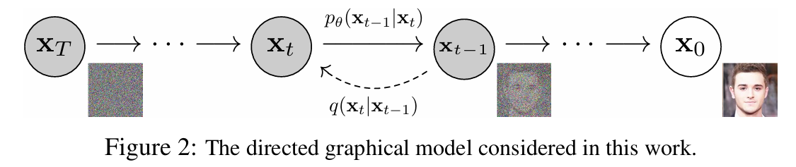

+++
date = '2026-02-06T20:09:38+08:00'
draft = true
title = 'Transformer + 扩散模型：DiT 入门'
ShowToc = false
math = true
categories = ["draft"]
tags = [
    "deep-learning",
    "transformer",
    "pytorch",
    "python",
    "DDPM",
    "DiT"
]
+++

> 本文内容基于论文 [Scalable Diffusion Models with Transformers](https://arxiv.org/abs/2212.09748)。
> 
> 但文章内容并不是论文阅读笔记，而是对 DiT 的入门介绍。未来有机会可以写一个详细的阅读笔记。

## 扩散模型介绍

扩散模型（***Denoising Diffusion Probabilistic Models***，DDPMs）在图像/音频/视频生成方面取得了显著的成果。

本文中，采用离散时间（潜变量模型）（discrete-time (lantent variable model)）的视角，事实上有多种关于扩散模型的观点，可以都去了解一下。

> 随机微分方程（SDE）、得分匹配（Score Matching）、朗之万动力学（Langevin Dynamics）、变分推断视角（Variational Inference）……

我们常说的机器学习，或者更准确一些，**监督学习**中，我们做的是“**判别**”：

- 输入：一张猫的图片

- 输出：标签”cat“

- 本质：学习 p(y|x) （给定图片，预测类别）

而扩散模型做的是”**生成**“，可以理解为与监督学习相反的问题：

- 输入：随机噪声

- 输出：一张猫的图片

- 本质：学习 p(x) （数据本身的分布）

下面，让我们详细看看扩散模型是如何完成它的工作的：



### 前向过程：数据 → 噪声

我们定义一个固定的、不需要学习的**前向过程**（***Forward Process***），把真实图像 $x_0$ 逐步变成纯噪声 $x_T$ 。

> #### ***为什么要做这个？***
> 
> 我们在 前向过程 中人为构造一条从**数据到噪声**的渐进式退化路径。
> 
> 扩散模型可以理解为一个**去噪网络**，它的工作流程就是对着一张图片（初始是随机噪声），一步一步去掉噪声，最后得到我们要生成的目标图片。
> 
> 那么，我们现在手上有原始图片，我们希望模型学会如何去噪，需要从这一张图片构造出足够多的**训练数据**供扩散模型学习。
> 
> 我们把原始图片一步步加噪，得到一系列图片（每个图片即对应一个时间步 $t$ ），每个图片都比前一张有更多噪声，直到最后成为纯噪声。
> 
> 然后我们把这一系列图片反过来看，就是一个从纯噪声一步步变成目标图片的过程，这就是扩散模型需要的**训练数据**。它会从这一系列数据中**学会**去噪的技巧，最后能够按需求生成图片。
> 
> 总而言之，这就是前向过程可以理解为<mark>**训练数据的构造方式**</mark>。

这个数据到噪声的过程是一步步进行的。我们看到其中一步：

#### 单步转移

从第 $t-1$ 步到 第 $t$ 步，我们做的就是依赖当前状态，加一点点高斯噪声：

$$
q(x_t|x_{t-1})=\mathcal{N}(x_t; \sqrt{1-\beta_t} x_{t-1},\beta_t \mathbf{I})
$$

- $\beta_t$ 是一个很小的数（比如 0.0001 ~ 0.02），它表示这一步“加多少噪声”。
  
  一般来说
  
  - $t$ 越小，$\beta_t$ 越小，$x_t$ 越接近 $x_{t-1}$ （添加的噪声少）
  - $t$ 越大，$\beta_t$ 越大，$x_t$ 越接近纯噪声

- $\sqrt{1-\beta_t}$ 是**信号保留比例** ，$\sqrt{\beta_t}$ 是**噪声加入比例**

- 这个式子本身表示：
  
  > $x_t$ 是从以 $\sqrt{1-\beta_t}x_{t-1}$ 为均值，$\beta_t \mathbf{I}$ 为方差的高斯分布中采样得到的。
  
  等价于：$x_t=\sqrt{1-\beta_t}x_{t-1}+\sqrt{\beta_t}\epsilon$ ，其中 $\epsilon \sim \mathcal{N}(0, \mathbf{I})$ 

---

这里涉及好多数学概念，我们来解释一下：

1. 马尔可夫性质
   
   对于一个随机过程，如果**未来状态只依赖于当前状态，而与过去状态无关**，我们说它具有**马尔可夫性质**（***Markov Property***）
   
   显然，前向过程是具有马尔可夫性质的。

2. $x_t$ 是一个张量（Tensor），可以看作是**展平后的向量**或保持结构的**多维数组**
   
   - 对于MNIST手写数字数据集，每个图片是28×28的单通道灰度图，在数学上，$x_t \in \mathbb{R}^{1 \times 28 \times 28}$ 
   
   - 对于 ImageNet 等彩色图像数据集，每个图片有3通道RGB，256×256分辨率，在数学上，$x_t \in \mathbb{R}^{3 \times 256 \times 256}$

3. $\mathbf{I}$ 是**单位矩阵**（***Identity Matrix***），对角线元素全为 1 ，其余元素全为 0 的方阵。
   
   - $\beta_t \mathbf{I}$ 表示协方差矩阵是对角阵，意味着图像的每个像素**独立地添加高斯噪声**，像素之间没有相关性
   
   - **各向同性**：所有维度的方差都是 $\beta_t$ ，没有某个像素被特别对待

4. $q(\cdot|\cdot)$ 是**条件概率分布**，与反向过程 $p_\theta$ 
   
   $q(x_t | x_{t-1})$ 表示：给定 $x_{t-1}$ 时，$x_t$ 的条件分布

5. 高斯分布 = 正态分布，$\mathcal{N}(0, \mathbf{I})$ 是标准高斯分布，均值为0，方差为1，各维度独立

---

#### 重参数化技巧（Reparameterization Trick）

我们拿着 $x_0$ ，要通过上面的式子算到 $x_T$ ，需要循环迭代 $T$ 次。

这时候，就要数学工具登场了：**多次叠加的高斯噪声，等价于一次更加大的高斯噪声**。这一点可以通过数学推导得到。

由此，我们可以直接从 $x_0$ 跳到任意第 $t$ 步：

$$
q(x_t|x_0)=\mathcal{N}(x_t;\sqrt{\overline{\alpha}_t}x_0,(1-\overline{\alpha}_t)\mathbf{I})
$$

其中，$\overline{a}_t$ 是累计信号比例：

$$
\overline{a}_t = \prod_{i=1}^{t}(1-\beta_i)
$$

$\sqrt{\overline{\alpha}_t}$ 从 1 衰减到 0，意味着随着 $t$ 增大，$x_0$ 的信号越来越少，噪声越来越多

最后我们得到：

$$
x_t=\sqrt{\overline{\alpha}_t}x_0 + \sqrt{1-\overline{\alpha}_t} \epsilon
$$

> 我们会在代码中看到这个式子的应用

至此，我们得到了每个 $t$ 对应的一个 $x_t$ ，分别对应一个时间步时的加噪图片

### 反向过程：学习“去噪”的神经网络

与固定的前向过程不同，反向过程 $q(x_{t-1}|x_t)$ 是未知的。我们用神经网络来近似：

$$
p_\theta(x_{t-1}|x_t) = \mathcal{N}(x_{t-1};\mu_\theta(x_t,t),\Sigma_\theta(x_t,t))
$$

该式子表示：给定当前时刻 $t$ 的带噪图像 $x_t$ ，上一时刻（更清晰）的图像 $x_{t-1}$ 服从一个**由神经网络参数化**的高斯分布。

其中 $\theta$ 表示神经网络的权重，我们看到有两个由神经网络训练得到的变量：

1. $\mu_\theta(x_t,t)$ ：神经网络预测的**均值**

2. $\Sigma_\theta(x_t,t)$：神经网络预测的**方差**

> 也就是说，我们给定 $x_t$ ，神经网络需要学习计算 $\mu_\theta$ 和 $\Sigma_\theta$ ，然后得到对应高斯分布，并采样得到 $x_{t-1} \sim \mathcal{N}(\mu_\theta,\Sigma_\theta)$ 。
> 
> 然后一步一步迭代，最后可以通过神经网络得到 $x_0$ ，即清晰的目标图像

#### 简化假设

DDPM 原论文做了两个核心简化，让问题变得可解

1. **方差固定**：$\Sigma_\theta$ 不学习，直接用 $\beta_t$ 或 $\tilde{\beta}_t$ （后验方差）
   
   原论文发现，学习方差**对生成质量提升有限，同时又会显著增加训练难度**。
   
   因此，作者给出两个方案：
   
   1. $\Sigma_\theta(x_t,t)=\beta_t\mathbf{I}$ ，使用前向过程的噪声强度
      
      - $\beta_t \in (0,1)$ 是前向过程中第 $t$ 步**人为设定**的噪声方差
      
      - 它表示从 $x_{t-1}$ 到 $x_t$ 时，新注入的高斯噪声的强度
      
      - 本身与数据无关，由调度方案决定
   
   2. $\Sigma_\theta(x_t, t) = \tilde{\beta}_t \mathbf{I}$ ，使用真实后验的方差
      
      - $\tilde{\beta_t} = \frac{1-\overline{\alpha}_{t-1}}{1-\overline{\alpha}_t} \cdot \beta_t$ ，即真实后验分布 $q(x_{t-1} | x_t,x_0)$ 的方差
      
      - 表示：如果我们知道 $x_0$ ，从 $x_t$ 反推 $x_{t-1}$ 时的不确定性
      
      - 依赖累计信号 $\overline{\alpha}_t$ ，与数据分布有关
      
      > 后验是一个**概率分布**，而不是单一数值。
      > 
      > - 均值：最可能的估计值
      > 
      > - 方差：这个估计的不确定性有多大
      > 
      > 结合这里的场景，反向过程中，我们已知 $x_t$ ，需要推断 $x_{t-1}$。
      > 
      > 对于后验分布 $q(x_{t-1} | x_t,x_0)$ ，表示此时我们在上述情况的基础上，还知道 $x_0$ 。由于前向过程是高斯分布，这个后验有解析解，可以得到方差 $\tilde{\beta_t} = \frac{1-\overline{\alpha}_{t-1}}{1-\overline{\alpha}_t} \cdot \beta_t$ 。
      > 
      > > 这个结论可以通过数学推导得到，未来可以补充
      > 
      > 但实际上，反向过程的真实后验应该是 $q(x_{t-1}|x_t)$ ，这个分布就没有解析解，因为反向过程中 $x_0$ 是未知的。
      > 
      > 对于这个方案，我们就是拿已知 $x_0$ 时的方差 $\tilde{\beta}_t$ 来近似未知 $x_0$ 时的真实方差，计算简单且效果足够好。 
   
   实验表明，两种方案效果接近，且都不比学习方差差太多。
   
   > 这种简化方案还有更多有力的理论基础在，未来可以补充。

2. **只学习均值** $\mu_\theta$ ，而且通过预测噪声来间接学习均值

#### 从噪声预测到均值

真实的后验均值如下所示：

$$
\tilde{\mu}_t(x_t,x_0)=\frac{\sqrt{\overline{\alpha}_{t-1}}\beta_t}{1-\overline{\alpha}_t}x_0+\frac{\sqrt{\alpha_t}(1-\overline{\alpha}_{t-1})}{1-\overline{\alpha}_{t-1}} x_t
$$

> 这个公式描述的分布是：$q(x_{t-1}|x_t,x_0)$ ，
> 
> 这里的说的后验均值指的是：理想状态下已知 $x_0$ 和 $x_t$ 时 $x_{t-1}$ 的期望值。
> 
> 也就是说，这里也是一个近似，并不是真实的反向过程。
> 
> 具体推导用到了贝叶斯公式，未来有机会补充一下。

但在反向过程中， $x_0$ 未知。我们可以用前向公式的逆运算得到 $x_0$ ：

$$
x_0=\frac{x_t-\sqrt{1-\overline{\alpha}_t}\epsilon}{\sqrt{\overline{\alpha}_t}}
$$

> 这里有一个会困惑的点，这个 $x_0$ 的式子是恒等式，而**不是近似**。
> 
> 用大白话讲，$x_0$ 就是这么算出来的。
> 
> 由此，均值可以用 $\epsilon$ 表示，神经网络需要训练的变量也就从均值转变为了**噪声**（见下）

代入得到：

$$
\tilde{\mu}_t=\frac{1}{\sqrt{\alpha_t}}\big( x_t - \frac{1-\alpha_t}{\sqrt{1-\overline{\alpha_t}}} \epsilon \big)
$$

至此，我们只要训练一个神经网络 $\epsilon_\theta$ 来预测噪声 $\epsilon$ ，就能算出均值$\mu_\theta$，进而采样 $x_{t-1}$ ：

$$
\mu_\theta=\frac{1}{\sqrt{\alpha_t}}\big( x_t - \frac{1-\alpha_t}{\sqrt{1-\overline{\alpha_t}}} \epsilon_\theta(x_t,t) \big)
$$

> 对于这个式子有几点说明一下：
> 
> - $\alpha_t$ 和 $\tilde{\alpha}_t$ 的区别：
>   
>   - $\alpha_t=1-\beta_t$ ，单步信号保留系数（第 $t$  步这一时刻）
>   
>   - $\overline{\alpha}_t=\prod^t_{i=1} \alpha_i$ ，累积信号保留系数（从第 1 步到第 $t$ 步的连乘）  
> 
> - $\epsilon_\theta(x_t,t)$ 表示我们的神经网络输入是 $x_t$ 和 $t$ 。这点会在代码中体现。

### 训练目标

经过前文一系列数学变换，我们最后得到简洁的神经网络训练目标

$$
\mathcal{L}=\mathbb{E}_{x_0,\epsilon,t}[||\epsilon-\epsilon_\theta(x_t,t)||^2]
$$

- $\mathbb{E}$ 是**期望符号**，这里表示对三个随机变量（$x_0,\epsilon,t$）求期望
  
  即在**所有可能的训练图像、所有可能的噪声、所有可能的时间步**上，求平均损失

- $||\cdot||^2$ 表示**均方误差 MSE** 

> 这里实际上涉及一些数学概念。作为生成模型，扩散模型直观的训练目标是生成图像尽可能像真实目标图像，这在数学上是需要比较两个复杂分布的相似度。
> 
> 但经过上述的简化，我们把训练目标变成了预测噪声，可以理解为向量与向量之间比较。这无疑大大减轻了问题的解决难度。
> 
> 我们称这个数学变换过程为**变分下界（*Variational Lower Bound, ELBO*）简化**。

我们来直观理解一下这个神经网络的训练流程：

1. 随机采样一个真实图像 $x_0$ 

2. 随机采样一个时间步 $t \in [1,T]$ 

3. 随机采样噪声 $\epsilon \sim \mathcal{N}(0,\mathbf{I})$ 

4. 生成 $x_t=\sqrt{\overline{\alpha}_t}x_0 + \sqrt{1-\overline{\alpha}_t}\epsilon$ 

5. 模型预测 $\epsilon_\theta(x_t,t)$ 

6. 计算损失 = 真实噪声与预测噪声的均方误差（MSE）

至此，我们训练得到了一个会去噪的神经网络。

### 采样过程——如何生成图像

训练好模型后，生成图像的过程是这样的：

1. 从纯噪声 $x_T \sim \mathcal{N}(0,\mathbf{I})$ 开始

2. 从 $t=T$ 到 $t=1$，循环：
   
   1. 模型预测噪声 $\epsilon_\theta(x_t,t)$ 
   
   2. 计算 $x_0$ 的预测
   
   3. 计算均值 $\mu_\theta$ 
   
   4. 采样 $x_{t-1}=\mu_\theta+\sqrt{\beta_t}z$
      
      $z$ 是标准高斯噪声，$t=1$时不加噪声
   
   > 这里，根据前面提到的后验分布，$\mu_\theta$ 即为网络认为最可能的 $x_{t-1}$ 
   > 
   > 但这里我们并不直接输出，而是加上了一个新采样的高斯噪声 $\sqrt{\beta_t}z$
   > 
   > 因为生成模型的生成目标并不是确定性的，我们希望生成多样化的目标，所以加上噪声能够避免生成过程变成确定性映射。
   > 
   > 至于 $t=1$ 时不加噪声，是希望最后的结果是清晰的

3. 返回 $x_0$ 

## DiT 架构详解

## 代码实践

这里，我们用 MNIST 数据集（手写数字）来做一个简单的小案例，用扩散模型生成指定数字的**单通道灰度图**。

---

下面的 “**代码详细解释**” 中，我会把我自己在代码中不懂或困惑的地方进行详细说明，可能会有些冗余。

读者可按需阅读或跳过。

---

### config.py

集中管理所有超参数，避免魔法数字散落在代码中



#### 代码细节解释

- Patch 与 Batch 区分
  
  - **Patch**：一次性送进模型的**一组样本**
  
  - **Batch**：将一张大图切成**小方块**，每个方块是一个 token
  
  - 对于我们的例子：
    
    ```python
    class DiTConfig:
        """DiT 模型架构配置"""
        ……
        patch_size: int = 4     # 4×4 patches -> 7×7=49 tokens
    
    class TrainConfig:
        """训练配置"""
        # 数据
        batch_size: int = 64
    ```
    
    - 一张图：28×28；Patch 大小：4×4；切成 7×7=49 个patches
    
    - Batch=64，一次处理 64 张图

- **Beta** 控制每一步加多少噪声
  
  ```python
  class DiffusionConfig:
      """扩散过程配置"""
      ……
      schedule: str = "linear"    # beta 调度方式：linear/cosine
  ```
  
  - **Linear**：直线增长，均匀加噪；简单，但后期可能加噪过快
  
  - **Cosine**：余弦曲线，先慢后快；更平滑，训练更稳定

- ***采样***  可以理解为 **生成图片的过程**
  
  - 训练时：从真实图像出发，前向加噪学习
  
  - 采样时：从纯噪声出发，反向去噪生成
  
  - 因为每步都从概率分布（高斯分布）中**随机抽取**数值，不是确定性计算

- **权重衰减**（***Weight Decay***）是防止模型过拟合的正则化手段
  
  - 普通梯度下降：参数=参数-学习率×梯度
  
  - 带上权重衰减：参数=参数-学习率×梯度 - **学习率×weight_decay×参数**
    
    ```python
    class TrainConfig:
        """训练配置"""
        ……
        # 优化器
        ……
        weight_decay: float = 0.03
    ```
  
  - 强迫模型参数保持小数值，避免过于依赖“一家独大”的参数，提升模型**泛化能力**

- `@dataclass` 自动为类生成样板代码（`__init__`、`__repr__`、`__eq__`），减少重复代码

### utils.py

纯工具函数，无状态，可被任何模块导入



#### 代码细节解释

这里挑选**一部分我感到困惑的内容**来详细说明。

##### 正弦位置编码 `timestep_embedding()`

把整数时间步（如 0, 1, 2, ..., 999）编码为高维向量（如 256 维），让神经网络“感知”当前处于去噪的哪个阶段。

比如第100步与第900步的去噪策略完全不同，因此我们需要把时间步变成一个“特征向量”来告诉模型“现在处于扩散过程的哪个位置”。

这里我们编码的思想参考了 Transformer 的原论文，但用于**连续时间**而不是序列位置。

对于每个时间步，我们会根据一定的规则把它映射到一个向量上。

向量中各个维度映射规则如下所示：

设 `dim=D`，则 `half=D//2`。

1. **频率公式**
   
   $\omega_i=\exp(-\ln(\text{max\_period})\cdot\frac{i}{\text{half}})=\frac{1}{\text{max\_period}^{i/\text{half}}}$
   
   其中，$i \in [0, 1, \dots,\text{half}-1]$
   
   ```python
       half = dim // 2
       freqs = torch.exp(
           -math.log(max_period) * torch.arange(0, half, dtype=torch.float32) / half
       ).to(timesteps.device)
   ```

> 代码中为什么要用 **exp-log 形式**而不是分数？
> 
> 1. 数值更加稳定，分数形式会有边界问题；exp-log 形式全程连续可导，无边界问题。
> 
> 2. 计算效率更高，幂运算通常比 `exp` 更慢。

2. **维度映射通式**
   
   对于输出向量的第 $d$ 维（$d \in [0, 1, \dots, D-1]$）：
   
   $\text { embedding }[d]=\left\{\begin{array}{ll}
    \cos \left(t \cdot \omega_{d}\right) & \text { if } d<\text { half } \\
    \sin \left(t \cdot \omega_{d-\text { half }}\right) & \text { if } d \geq \text { half }
    \end{array}\right.$ 
   
   ```python
       args = timesteps[:, None].float() * freqs[None, :]                  # [B, half]
       embedding = torch.cat([torch.cos(args), torch.sin(args)], dim=-1)   # [B, dim]
   ```

以 `dim=4` 为例：

| 维度  | 计算公式                     |
| --- | ------------------------ |
| 0   | $\cos(t \cdot \omega_0)$ |
| 1   | $\cos(t \cdot \omega_1)$ |
| 2   | $\sin(t \cdot \omega_0)$ |
| 3   | $\sin(t \cdot \omega_1)$ |

>  值得一提的是，当 dim 为奇数时，我们让最后一个维度不参与编码，即补零。
> 
> 以 `dim=7` 为例：
> 
> | 维度    | 计算公式                     |
> |:-----:|:------------------------ |
> | 0     | $\cos(t \cdot \omega_0)$ |
> | 1     | $\cos(t \cdot \omega_1)$ |
> | 2     | $\cos(t \cdot \omega_2)$ |
> | 3     | $\sin(t \cdot \omega_0)$ |
> | 4     | $\sin(t \cdot \omega_1)$ |
> | 5     | $\sin(t \cdot \omega_2)$ |
> | **6** | **0**                    |
> 
> ```python
>     # 奇数维度时补零
>     if dim % 2:
>         embedding = torch.cat([embedding, torch.zeros_like(embedding[:, :1])], dim=-1)
> ```

##### `patchify()` 与 `unpatchify()`

这两个函数实现了**像素网络**与**Token序列**之间的转换。

具体细节没什么好说的，我们借此总结一些 Pytorch 的常见方法：

- `unflod()` - 滑动窗口提取
  
  在指定维度上以固定步长提取滑动窗口
  
  ```python
  x.unfold(dimension, size, step)
  ```
  
  ```python
      x = x.unfold(2, patch_size, patch_size).unfold(3, patch_size, patch_size)
  ```
  
  在 H, W 维度上展开，窗口大小=步长= `patch_size`
  
  举个例子，把 28×28 图像切成 4×4 的小块，每块独立成维。

- `reshape()` vs `view()`
  
  `reshape()` = `view()` + `contiguous()`
  
  - `view()` 速度更快，但要求内存连续（确定连续时推荐使用）
  
  - `reshape()` 自动处理非连续，必要时拷贝（不确定连续性时）
  
  `view()` 用于改变张量形状，不改变数据内容
  
  ```python
      # [B, N, C*p*p]
      patches = x.view(B, -1, C * patch_size * patch_size)
  ```
  
  > `-1` 让 Pytorch 自动计算该维度大小，避免手动算 N。

- `permute()` - 维度重排
  
  按指定顺序重新排列张量维度。
  
  ```python
      # [B, C, H//p, p, W//p, p] -> [B, H//p, W//p, C, p, p]
      x = x.permute(0, 2, 3, 1, 4, 5).contiguous()
  ```

- `contiguous()` - 内存连续性保证
  
  确保张量在内存中连续存储，使 `view()` 能正常工作。
  
  - `permute()`、`unflod()` 等操作会改变内存布局，导致张量**不连续**
  
  - `view()` 要求连续内存，否则报错

##### 统计模型可训练参数量 `count_parameters()`

还是一样，我们来看看这个函数中 Pytorch 的相关方法与属性

- `numel()` - 元素计数
  
  返回张量中**元素的总个数**（number of elements）

- `parameters()` - 参数迭代器
  
  返回模型**所有可学习参数**的生成器，用于遍历

- `requires_grad` - 梯度追踪标志
  
  标记张量**是否需要计算梯度**（是否参与训练）
  
  | 值       | 含义           | 场景           |
  |:------- |:------------ |:------------ |
  | `True`  | 需要梯度，反向传播时更新 | 可学习参数        |
  | `False` | 冻结，不更新       | 预训练模型冻结、推理模式 |

##### Beta 噪声调度 `get_beta_schedule()`

这个函数生成扩散过程中每一步的噪声强度 $\beta_t$ ，控制“每一步加多少噪声”

函数返回 `betas`：`[timesteps]` 形状的一维张量，每个元素是 0~1 之间的浮点数

`betas[t]` = 第 t 步的噪声方差

这里我们着重看看**余弦调度**的实现：

###### 余弦调度

余弦调度的目标是：

> 让信号衰减速度遵循余弦曲线的平方，前期慢，后期快，形成平滑过渡

1. 定义累计信号比例
   
   定义从原始图像到第 $t$ 步**保留的信号比例**为：
   
   $$
   \overline{\alpha}_t=\cos^2(\frac{t}{T}\cdot\frac{\pi}{2})
   $$
- $t=0$ ：$\cos^2(0)=1$ ，完全保留信号

- $t=T$：$\cos^2(1)=0$，完全变成噪声

- 中间平缓过渡，曲线形状先缓后陡
2. 引入偏移量防止数值问题
   
   为了防止 $t=0$ 时导数过大，我们**引入偏移量** $s$（代码中取`s=0.008`）：
   
   $$
   \overline{\alpha}_t=\cos^2(\frac{\frac{t}{T}+s}{1+s}\cdot\frac{\pi}{2})/C
   $$
   
   其中 $C$ 是归一化常数，确保 $\overline{\alpha}_0=1

```python
alphas_cumprod = torch.cos(((x / timesteps) + s) / (1 + s) * math.pi * 0.5) ** 2
alphas_cumprod = alphas_cumprod / alphas_cumprod[0]
```

3. 从累计信号反推单步噪声
   
   已知
   
   $$
   \overline{\alpha}_t=\prod^t_{i=1}(1-\beta_i)
   $$
   
   > 这是扩散模型的核心，是 $x_0$ 无需迭代，可以直接得出任意 $x_t$ 的理论来源。具体推导见前文（待补充）
   
   则：
   
   $$
   \beta_i=1-\frac{\overline{\alpha}_t}{\overline{\alpha}_{t-1}}
   $$
   
   直观理解一下，每一步的噪声强度 = 1- 这一步相对于上一步保留了多少额外信号
   
   ```python
   betas = 1 - (alphas_cumprod[1:] / alphas_cumprod[:-1])
   ```

4. 裁剪保护
   
   ```python
   return torch.clip(betas, 0.0001, 0.9999)
   ```
   
   防止极端值导致数值不稳定

### diffusion.py



---

## 参考

- [[2212.09748] Scalable Diffusion Models with Transformers](https://arxiv.org/abs/2212.09748)

- [[2006.11239] Denoising Diffusion Probabilistic Models](https://arxiv.org/abs/2006.11239)

- [The Annotated Diffusion Model](https://huggingface.co/blog/annotated-diffusion)

- 
