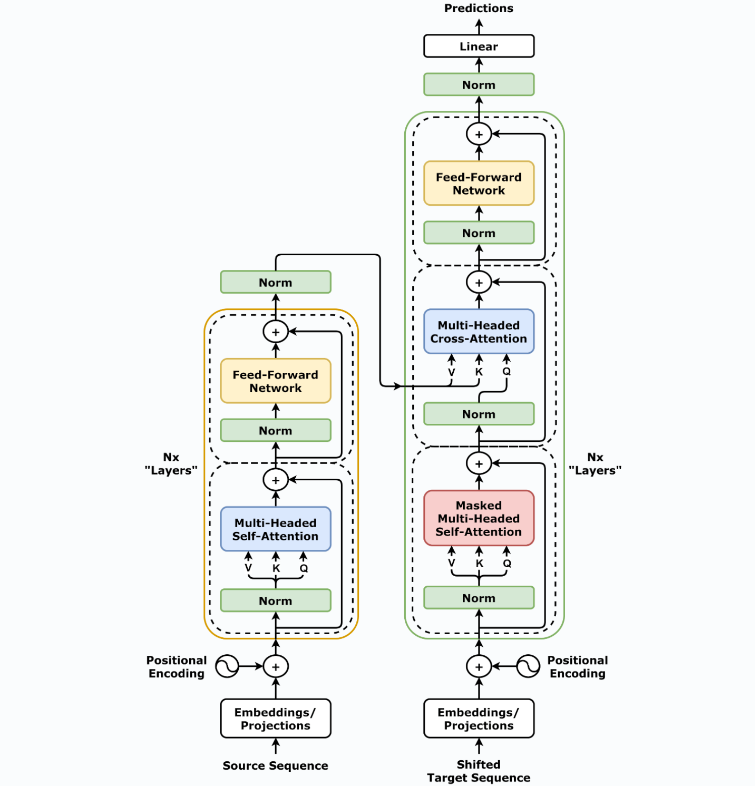

+++
date = '2026-02-15T11:12:29+08:00'
draft = false
title = '从零开始的Transformer(1): 架构拆解'
ShowToc = false
math = true
+++

在如今的深度学习领域，Transformer架构已经称得上是**经典模型**了。从最初的NLP自然语言处理到后来推广到计算机视觉领域，ChatGPT等一系列基于Transformer模型的产品，对世界带来翻天覆地的变化改变世界的充分说明了它的强大实力与重要作用。

作为深度学习领域的初学者，我想简单介绍这一经典架构的同时，用案例编码来学习模型的实际应用，为后续工作打打基础。

> 值得一提的，本文中给出的案例大部分还是来自NLP领域。

## Transformer 架构简介

### 语言模型

正如前文所说，Transformer最开始解决的问题是自然语言处理。Transformer 模型本质上都是预训练**语言模型**，在大量生语料上进行训练。我们可以看到两类常见的任务：

- 基于句子前$n$个词来预测下一个词。
  
  因为输出依赖于过去和当前的输入，该任务被称为**因果语言建模**（causal language modeling）。
  
  > 在气象预测领域，也常常见到这个**因果**（Causual）的概念。
  > 
  > 我们在训练模型预测未来天气时，预测的结果同样依赖于过去的输入，而不能受未来时间天气的影响，这样的预测符合现实逻辑的。
  
  

- 基于上下文（周围的词语）来预测句子中被遮盖掉的词语（masked word）。
  
  这类任务称为**遮盖语言建模**（masked language modeling）。
  
  

训练这类模型不需要人工标注数据，它们可以对训练过的语言产生*统计意义*上的理解。但如果直接拿来完成特定任务，效果往往不好。

### 迁移学习

前面提到的预训练相当于是从头开始训练模型：所有模型的权重都被随机初始化，并在没有先验知识的情况下开始训练。显而易见的，这个过程不仅需要海量的训练数据，时间经济成本都非常高。

因此，大部分情况下，我们将别人预训练好的模型权重通过 ***迁移学习*** 应用到自己的模型中，使用自己的任务语料对模型进行“二次训练“，通过微调参数使模型适用于新任务。

例如，我们可以选择一个在大规模英文语料上预训练好的模型，使用 arXiv 语料进行微调，以生成一个面向学术/研究领域的模型。

**在绝大部分情况下，我们都应该尝试找到一个尽可能接近我们任务的预训练模型，然后微调它。**

> 这一点在气象领域同样适用。我曾经看到过一个研究（[[2601.20342] StormDiT: A generative AI model bridges the 2-6 hour 'gray zone' in precipitation nowcasting](https://arxiv.org/abs/2601.20342)），它就使用了视频生成模型Cosmos-Predict2.5，然后再用气象数据训练它，最终得到气象领域的预测模型。

### Transformer 结构

一个常见的Transformer架构示例图如下所示：



看着很复杂哦，首先简化一下：


一个标准的 Transformer 模型主要由两个模块构成：

- Encoder（编码器）：负责理解输入文本，为每个输入构造对应的语义表示（语义特征）。

- Decoder（解码器）：负责生成输出，使用Encoder输出的语义表示结合其他输入来生成目标序列。

让我们详细看看两部分的内部结构：

#### 编码器

编码器由 N 层相同的模块堆叠而成，每层包括两个子层：

- 多头自注意力机制（Multi-Head Self-Attention）：计算输入序列中每个词与其他词的相关性。

- 前馈神经网络（Feed-Forward Neural Network）：对每个词进行独立的非线性变换

每个子层后面都接有残差连接（Residual Connection）和层归一化（Layer Normalization）

> - 残差连接
>   
>   - 输出 = 输入 + 子层（输入）
>   
>   - 图中 ⊕ 表示残差连接
>   
>   - 解决深层网络的梯度消失/退化问题，让网络“可选”地学习改变。如果子层学不到有用信息，至少还有恒等映射保底
> 
> - 层归一化
>   
>   - 对**单个样本**的所有特征维度做归一化
>     
>     - **LayerNorm**：归一化维度 = 特征维度（每样本独立）→ 适合变长序列
>     
>     - **BatchNorm**：归一化维度 = batch维度（跨样本统计）→ 序列长度变化时统计不稳定

#### 解码器

解码器也由 N 层相同的模块堆叠而成，每层包含三个子层：

- 掩码多头自注意力机制（Masked Multi-Head Self-Attention）：计算输出序列中每个词与前面词的相关性（使用掩码防止未来信息泄露）。
- 编码器-解码器注意力机制（Encoder-Decoder Attention）：计算输出序列与输入序列的相关性。
- 前馈神经网络（Feed-Forward Neural Network）：对每个词进行独立的非线性变换。

同样，每个子层后面都接有残差连接和层归一化。

#### 其他

图中还有一些内容说明如下：

1. Source Sequence（源序列）
   
   - 模型的输入，源语言/源文本的token序列

2. Embeddings/Projections（嵌入/投影）
   
   - 嵌入指的是将离散的token ID映射为**连续稠密的向量表示**；
   
   - 投影类似，强调将高维one-hot投影到低维连续空间

3. Positional Encoding（位置编码）
   
   - Attention机制本身是**位置无关**（permutation invariant）的，需要显式注入位置信息
   
   - 比如，"我爱机器"和"机器爱我"对Attention来说没有区别。
   
   - 图中（~）的实现方式是：**正弦/余弦函数**（Sinusoidal）
     
     $$
     PE_{(pos,2i)}=\sin{\frac{pos}{10000^{2i}/d_{model}}}
     $$
     
     $$
     PE_{(pos,2i+1)}=\cos{\frac{pos}{10000^{2i}/d_{model}}}
     $$
     
     变量含义如下：
     
     | 符号        | 含义                                     |
     | --------- | -------------------------------------- |
     | `pos`     | token在序列中的位置（0, 1, 2, ..., max\_len-1） |
     | `i`       | 维度索引（0, 1, 2, ..., d\_model/2 - 1）     |
     | `2i`      | 偶数维度                                   |
     | `2i+1`    | 奇数维度                                   |
     | `d_model` | 模型维度（如512）                             |
     | `10000`   | 超参数，控制波长                               |
     
     - 其他方法：可学习位置编码（Learnable）

4. Norm（层归一化）
   
   - 对每个样本的**所有特征维度**进行归一化，稳定训练

5. Shifted Target Sequence（移位目标序列）
   
   - Decoder 的输入，在训练时采用 Teacher Forcing 策略，将目标序列向右移动一位
     
     > **Teacher Forcing**（教师强制）始终用真实标签（Ground Truth）作为下一步的输入，而不是用模型自己的预测。
     
     - 防止模型在预测位置 i 时候“偷看”到位置 i 及之后的目标token
     
     - 保持自回归特性：预测第 t 个词时只能依赖 t-1 个词

6. Predictions（预测输出）
   
   - 模型最终输出的概率分布，表示下一个token的预测结果

## 注意力机制

Transformer 模型与其他网络不同，也是它如此强大的原因，就是采用了注意力机制（Attention）来建模文本。

这里介绍最常见的 Multi-Head Attention。

### Attention

NLP 神经网络的本质是对输入文本进行编码，常规的做法如下：

1. 对句子进行分词

2. 将每个词语（token）都转换为对应的词向量（token embeddings）

由此，文本转换为了一个词语向量组成的矩阵：$\boldsymbol{X}=(\boldsymbol{x}_1,\boldsymbol{x}_2,\dots,\boldsymbol{x}_n)$，其中$\boldsymbol{x}_i$就表示第$i$个词语的词向量，维度为$d$，故$\boldsymbol{X}\in \mathbb{R}^{n\times d}$

与循环网络（RNNs）和卷积网络（CNNs）相比，Attention机制一步到位获取了全局信息：

$$
\boldsymbol{y}_t = f(\boldsymbol{x}_t,\boldsymbol{A},\boldsymbol{B})
$$

其中，$\boldsymbol{A}$，$\boldsymbol{B}$是另外的词语序列（矩阵），如果取$\boldsymbol{A}=\boldsymbol{B}=\boldsymbol{X}$，就称为 ***Self-Attention***，即直接将 $\boldsymbol{x}_t$ 与自身序列中的每个词语进行比较，最后算出 $\boldsymbol{y}_t$

### Scaled Dot-product Attention

Attention的实现方式有很多，其中最常见的之一是： ***Scaled Dot-product Attention***。

#### 原理解释


- Q（Query，查询），K（Key，键），V（Value，值）

- 它们的作用可以用 Query 去匹配 Key，找到最相关的 Key，然后取出对应的 Value。

- 输入序列 $\mathbf{X} \in \mathbf{R}^{n \times d_{model}}$，通过三个独立的线性投影得到。
  
  其中， $\boldsymbol{W}^{Q},\boldsymbol{W}^{K},\boldsymbol{W}^{V}$ 是可学习的投影矩阵，是模型训练的内容之一
  
  $$
  \boldsymbol{Q}=\boldsymbol{X}\boldsymbol{W}^{Q},\boldsymbol{K}=\boldsymbol{X}\boldsymbol{W}^{K},\boldsymbol{V}=\boldsymbol{X}\boldsymbol{W}^{V}
  $$
  
  > 注意区分这里与多头注意力机制，两者是不同的

- 我们希望模型学习不同的语义空间
  
  - Q 和 K：用于计算相似度，需要在一个空间内可比
  
  - V：用于提取内容，可以（通常）在不同空间

主要步骤如下：

1. **计算注意力权重**
   
   使用某种相似度函数度量每一个 query 向量和所有 key 向量之间的关联程度。对于长度为 $m$ 的 Query 序列和长度为 $n$ 的 Key 序列，该步骤会生成一个尺寸为 $m \times n$ 的注意力分数矩阵。
   
   特别地，Scaled Dot-product Attention 使用点积作为相似度函数，这样相似的 queries 和 keys 会有较大的点积。
   
   > 为什么点积能衡量相似度？
   > 
   > | 情况     | 夹角 $\theta$ | $\cos\theta$ | 点积大小  | 含义    |
   > | ------ | ----------- | ------------ | ----- | ----- |
   > | 方向完全相同 | $0°$        | $1$          | 最大（正） | 高度相似  |
   > | 方向正交   | $90°$       | $0$          | $0$   | 无关    |
   > | 方向相反   | $180°$      | $-1$         | 最大（负） | 相反/排斥 |
   
   由于点积可以产生任意大的数字，这会破坏训练过程的稳定性。因此注意力分数还需要乘以一个缩放因子来标准化它们的方差（图中的 *Scale*），然后用一个 softmax 标准化。这样就得到了最终的注意力权重 $w_{ij}$，表示第 $i$ 个 query 向量与第 $j$ 个 key 向量之间的关联程度。

2. **更新 token embeddings**
   
   将权重 $w_{ij}$ 与对应的 value 向量 $\boldsymbol{v}_1,…,\boldsymbol{v}_n$ 以获得第 $i$ 个 query 向量更新后的语义表示 $\boldsymbol{x}_i’ = \sum_{j} w_{ij}\boldsymbol{v}_j$

上述过程的形式化表示为：

$$
\text{Attention}(\boldsymbol{Q},\boldsymbol{K},\boldsymbol{V}) = \text{softmax}\left(\frac{\boldsymbol{Q}\boldsymbol{K}^{\top}}{\sqrt{d_k}}\right)\boldsymbol{V}
$$

其中，

- $\boldsymbol{Q}\in\mathbb{R}^{m\times d_k}, \boldsymbol{K}\in\mathbb{R}^{n\times d_k}, \boldsymbol{V}\in\mathbb{R}^{n\times d_v}$ 分别是 query、key、value 向量序列。

- 如果忽略 softmax 激活函数，实际上它就是三个 $m\times d_k,d_k\times n, n\times d_v$ 矩阵相乘，得到一个 $m\times d_v$ 的矩阵

- 也就是将 $m\times d_k$ 的序列 $\boldsymbol{Q}$ 编码成了一个新的 $m\times d_v$ 的序列。

把这个公式拆开会更清楚：

$$
\text{Attention}(\boldsymbol{q}_t,\boldsymbol{K},\boldsymbol{V}) = \sum_{s=1}^n \frac{1}{Z}\exp\left(\frac{\langle\boldsymbol{q}_t, \boldsymbol{k}_s\rangle}{\sqrt{d_k}}\right)\boldsymbol{v}_s
$$

- $Z$ 是归一化因子，$\boldsymbol{K},\boldsymbol{V}$ 是一一对应的 key 和 value 向量序列

- Scaled Dot-product Attention 就是通过 $\boldsymbol{q}_t$ 这个 query 与各个 $\boldsymbol{k}_s$ 内积并 softmax 的方式来得到 $\boldsymbol{q}_t$ 与各个 $\boldsymbol{v}_s$ 的相似度，然后加权求和，得到一个 $d_v$ 维的向量。

- 其中因子 $\sqrt{d_k}$ 起到调节作用，使得内积不至于太大。

#### 代码实现

这里我们来手搓一个 Scaled Dot-product Attention：

##### 1. 分词和词嵌入

首先需要将文本分词为词语（token）序列，然后将**每个词语转换为对应的词向量**（embedding）。

Pytorch提供了 `torch.nn.Embedding` 来完成该操作，构建一个 token ID 到 token embedding 的映射表：

```python
from torch import nn
from transformers import AutoConfig
from transformers import AutoTokenizer

# 1. 加载分词器
model_ckpt = "bert-base-uncased"
tokenizer = AutoTokenizer.from_pretrained(model_ckpt)

# 2. 文本分词
text = "time flies like an arrow"
inputs = tokenizer(text, return_tensors="pt", add_special_tokens=False)
print(inputs.input_ids)

# 3. 加载模型配置
config = AutoConfig.from_pretrained(model_ckpt)

# 4. 创建嵌入层
token_emb = nn.Embedding(config.vocab_size, config.hidden_size)
print(token_emb)

# 5. 获取词嵌入
inputs_embeds = token_emb(inputs.input_ids)
print(inputs_embeds.size())
```

> 运行代码时，可能会遇到 **SSL 证书验证失败**，无法连接到 Hugging Face 下载模型。
> 
> 可以尝试在代码最前面加上，使用国内镜像站：
> 
> ```python
> import os
> os.environ['HF_ENDPOINT'] = 'https://hf-mirror.com'  # 使用镜像站
> ```

```python
# 输出
tensor([[ 2051, 10029,  2066,  2019,  8612]])
Embedding(30522, 768)
torch.Size([1, 5, 768])
```

从输出结果可以看到，BERT-base-uncased 模型对应的词表大小为 30522，每个词语词向量维度为 768。

Embedding 层把输入的词语序列映射到了 `[batch_size, seq_len, hidden_dim]`的张量

> ###### 代码详解
> 
> ---
> 
> 下面是对代码的详细拆解，对模型**整体构建**关系**不大**，仅供学习参考，阅读时可以跳过。
> 
> 后面不再赘述。
> 
> ---
> 
> 1. 加载分词器
>    
>    - 从 Hugging Face 下载 `bert-base-uncased` 的分词器配置
>      
>      - `uncased` 表示不区分大小写，全部转小写
>    
>    - 加载 **WordPiece** 分词算法
>    
>    - 建立词汇表映射：单词 → 整数 ID
> 
> 2. 文本分词
>    
>    | 参数                         | 作用                                        |
>    | -------------------------- | ----------------------------------------- |
>    | `return_tensors="pt"`      | 返回 PyTorch tensor（而非 Python 列表）           |
>    | `add_special_tokens=False` | 不添加 `[CLS]` 和 `[SEP]` 等特殊标记，这里是为了演示方便这样设置 |
>    
>    | 分词结果  | Token ID |
>    | ----- | -------- |
>    | time  | 2051     |
>    | flies | 10029    |
>    | like  | 2066     |
>    | an    | 2019     |
>    | arrow | 8612     |
> 
> 3. 加载模型配置
>    
>    - 获取 BERT 的超参数
>      
>      - `vocab_size = 30522`：词汇表大小
>      
>      - `hidden_size = 768`：词向量维度
>      
>      - `num_hidden_layers = 12`：Transformer 层数
>      
>      - `num_attention_heads = 12`：注意力头数
>      
>      - `intermediate_size = 3072`：FFN 中间层维度
> 
> 4. 创建嵌入层
>    
>    - 一个可学习的查找表
>    
>    - 形状：[30522, 768]
>      
>      - 30522 是词汇表，768 是每个词的向量维度
>      
>      - 每行是一个词的唯一向量表示，随机初始化，训练时更新
> 
> 5. 获取词嵌入
>    
>    - 根据 ID 查表，取出对应行的向量
>    
>    - 输出形状：[1, 5, 768]

##### 2. 计算注意力分数矩阵

接下来创建 query、key、value 向量序列 $\boldsymbol{Q},\boldsymbol{K},\boldsymbol{V}$，并且使用点积作为相似度函数来计算注意力分数：

```python
import torch
from math import sqrt

# 1. 设置 Q = K = V
Q = K = V = inputs_embeds

# 2. 获取维度
dim_k = K.size(-1)

# 3. 计算注意力分数
scores = torch.bmm(Q, K.transpose(1, 2)) / sqrt(dim_k)
print(scores.size())
```

```python
# 输出
torch.Size([1, 5, 5])
```

这里 $\boldsymbol{Q},\boldsymbol{K}$ 序列长度都为5，因此生成了一个 5 × 5 的注意力分数矩阵。

> ###### 代码详解
> 
> 1. 设置 Q = K = V
>    
>    - 使用同一组向量作为 Query, Key, Value，这是 Self-Attention（**自注意力**）
>    
>    - 实际 Transformer 中，Q/K/V 是通过不同线性投影得到的，这里简化
> 
> 2. 获取维度
>    
>    - `K.size(-1)` 取最后一个维度，即词向量特征维度 768
> 
> 3. 计算注意力分数
>    
>    | 步骤                  | 操作                | 形状变化                                              |
>    | ------------------- | ----------------- | ------------------------------------------------- |
>    | `K.transpose(1, 2)` | 交换维度 1 和 2（从0开始数） | `[1, 5, 768]` → `[1, 5, 768]` 的转置 = `[1, 768, 5]` |
>    | `torch.bmm(Q, K.T)` | 批量矩阵乘法            | `[1, 5, 768] × [1, 768, 5]` → `[1, 5, 5]`         |
>    | `/ sqrt(768)`       | 缩放，防止点积过大         | `[1, 5, 5]`                                       |

##### 3. Softmax 归一化 + 加权求和

接下来是应用 Softmax 标准化注意力权重，最后将注意力权重与 value 序列相乘：

```python
import torch.nn.functional as F

# 1. Softmax 归一化
weights = F.softmax(scores, dim=-1)
print(weights.sum(dim=-1))

# 2. 加权求和
attn_outputs = torch.bmm(weights, V)
print(attn_outputs.shape)
```

```python
# 输出
tensor([[1., 1., 1., 1., 1.]], grad_fn=<SumBackward1>)
torch.Size([1, 5, 768])
```

> ###### 代码详解
> 
> 1. Softmax 归一化
>    
>    - 将分数转换为概率分布
>    
>    - 输入 `[1, 5, 5]` 的原始相似度分数
>    
>    - 输出 `[1, 5, 5]` 的概率分布
>      
>      - 每个值 $\in(0, 1)$
>      
>      - 每行求和 = 1
> 
> 2. 加权求和
>    
>    - `weights`: `[1, 5, 5]` — 注意力权重
>    
>    - `V`: `[1, 5, 768]` — 值向量
>    
>    - 结果: `[1, 5, 768]` — 上下文向量

##### 5. 总结

综上所述，我们封装一个简化版的 Scaled Dot-product Attention 函数，方便后续调用：

```python
import torch
import torch.nn.functional as F
from math import sqrt

def scaled_dot_product_attention(query, key, value, query_mask=None, key_mask=None, mask=None):
    dim_k = query.size(-1)
    scores = torch.bmm(query, key.transpose(1, 2)) / sqrt(dim_k)
    if query_mask is not None and key_mask is not None:
        mask = torch.bmm(query_mask.unsqueeze(-1), key_mask.unsqueeze(1))
    if mask is not None:
        scores = scores.masked_fill(mask == 0, -float("inf"))
    weights = F.softmax(scores, dim=-1)
    return torch.bmm(weights, value)    
```

这里值得一提的是，封装的函数还考虑了序列的 Mask。

语句中，填充（padding）的词语不应该参与计算，我们在对应位置设置mask，对应的注意力分数设置为 $-\infty$ ，这样 softmax 之后的注意力权重就变成了 $e^{-\infty}=0$

### Multi-head Attention

#### 原理解释

前面提到，我们实现的简单 Scaled Dot-product Attention 中，Q = K。

这会为上下文的相同单词分配非常大的分数（相同单词的点积相似度为1）。

在实践中，相关词比相同词更重要，因此，我们需要使用 ***多头注意力***（Multi-head Attention）。


通过线性映射，将 $\boldsymbol{Q},\boldsymbol{K},\boldsymbol{V}$ 映射到特征空间，每一组投影后的向量表示称为一个 ***头***（head）。

然后在每组映射后的序列上再应用 Scales Dot-product Attention。

每个注意力头负责关注某一方面的语义相似性，多个头可以让模型同时关注多个方面。因此，多头注意力可以捕获到更加复杂的特征信息。

形式化表达如下：

$$
head_i=\text{Attention}(\boldsymbol{Q}\boldsymbol{W}^Q_i,\boldsymbol{K}\boldsymbol{W}^K_i,\boldsymbol{V}\boldsymbol{W}^V_i)
$$

$$
\text{MultiHead}(\boldsymbol{Q},\boldsymbol{K},\boldsymbol{V})=\text{Concat}(head_1, \dots, head_h)
$$

其中 $W^Q_i\in\mathbb{R}^{d_k \times \tilde{d}_k},W^K_i\in\mathbb{R}^{d_k \times \tilde{d}_k},W^V_i\in\mathbb{R}^{d_v \times \tilde{d}_v}$ 是映射矩阵，$h$ 是注意力头的数量。

最后，将多头的结果拼接就得到 $m \times h\tilde{d}_v$ 的结果序列。

> - ”多头“（Multi-head）就是多做几次 Scaled Dot-product Attention，然后把结果拼接
> 
> - 上述公式中，$d_k,d_v$ 是原始的 Q、K、V 的维度；$\tilde{d}_k,\tilde{d}_v$ 是切分后每个头的 Q、K、V 维度
> 
> - 是的，这里看起来可能还是有些抽象，让我们到代码中看看。

#### 代码实现

##### 1. 一个注意力头

我们首先实现一个注意力头

```python
from torch import nn

class AttentionHead(nn.Module):
    def __init__(self, embed_dim, head_dim):
        super().__init__()
        self.q = nn.Linear(embed_dim, head_dim)
        self.k = nn.Linear(embed_dim, head_dim)
        self.v = nn.Linear(embed_dim, head_dim)

    def forward(self, query, key, value, query_mask=None, key_mask=None, mask=None):
        attn_outputs = scaled_dot_product_attention(
            self.q(query),
            self.k(key),
            self.v(value),
            query_mask,
            key_mask,
            mask
        )
        return attn_outputs
```

对于每个 head，我们初始化三个独立的线性层，分别负责将 $\boldsymbol{Q},\boldsymbol{K},\boldsymbol{V}$ 序列映射到尺寸为 `[batch_size, seq_len, head_dim]` 的张量。

> 实践中一般将 `head_dim` 设置为 `embed_dim` 的因数，这样 token 嵌入式表示的维度可以保持不变。
> 
> 例如 BERT 有12个注意力头，因此每个头的维度被设置为 $768/12=64$

##### 2. 拼接多个注意力头

只需要拼接多个注意力头的输出就可以构建出 Multi-head Attention 层了。

这里拼接后还通过一个线性变换来生成最终的输出张量。

```python
class MultiHeadAttention(nn.Module):
    def __init__(self, config):
        super().__init__()
        embed_dim = config.hidden_size
        num_heads = config.num_attention_heads
        head_dim = embed_dim // num_heads
        self.heads = nn.ModuleList(
            [AttentionHead(embed_dim, head_dim) for _ in range(num_heads)]
        )
        self.output_linear = nn.Linear(embed_dim, embed_dim)

    def forward(self, query, key, value, query_mask=None, key_mask=None, mask=None):
        x = torch.cat([
            h(query, key, value, query_mask, key_mask, mask) for h in self.heads
        ], dim=-1)
        x = self.output_linear(x)
        return x   
```

##### 3. 验证是否正常工作

这里用 BERT-base-uncased 模型的参数初始化 Multi-head Attention 层，并且将之前构建的输入送入模型以验证是否工作正常：

```python
from transformers import AutoConfig
from transformers import AutoTokenizer

model_ckpt = "bert-base-uncased"
tokenizer = AutoTokenizer.from_pretrained(model_ckpt)

text = "time flies like an arrow"
inputs = tokenizer(text, return_tensors="pt", add_special_tokens=False)
config = AutoConfig.from_pretrained(model_ckpt)
token_emb = nn.Embedding(config.vocab_size, config.hidden_size)
inputs_embeds = token_emb(inputs.input_ids)

multihead_attn = MultiHeadAttention(config)
query = key = value = inputs_embeds
attn_output = multihead_attn(query, key, value)
print(attn_output.size())
```

```python
# 输出
torch.Size([1, 5, 768])
```

## Transformer Encoder

回忆一下，标准 Transformer 结构中：

- Encoder 负责将输入的词语序列转换为词向量序列

- Decoder 则基于 Encoder 的**隐状态**来迭代生成词语序列作为输出，每次生成一个词语

> 隐状态（Hidden State）是神经网络在处理序列时产生的**中间表示向量**，编码了输入序列的上下文信息。

### The Feed-Forward Layer

在 Transformer 中，前馈子层（Feed-Forward Layer）实际上是两层全连接神经网络，它单独处理序列中每一个词向量，也被称为 ***position-wise feed-forward layer***。

最常见的做法是让第一层的维度是词向量的 4 倍，然后以 GELU 作为激活函数。

> - 4 倍是一个经验值，希望中间层能学习更复杂的非线性变换
> 
> - GELU 激活函数公式如下，其中 $\Phi (x)$ 是标准正态分布的累积分布函数（CDF）：
> 
>   $\text{GELU}(x) = x \cdot \Phi(x) = x \cdot \frac{1}{2} \Big [1+\text{erf} \Big (\frac{x}{\sqrt{2}} \Big ) \Big ]$
> 
>   GELU 以输入值的大小为概率决定是否保留该神经元，小值大概率归零，大值大概率保留，过渡平滑自然

#### 代码实现

```python
class FeedForward(nn.Module):
    def __init__(self, config):
        super().__init__()
        self.linear_1 = nn.Linear(config.hidden_size, config.intermediate_size)
        self.linear_2 = nn.Linear(config.intermediate_size, config.hidden_size)
        self.gelu = nn.GELU()
        self.dropout = nn.Dropout(config.hidden_dropout_prob)

    def forward(self, x):
        x = self.linear_1(x)
        x = self.gelu(x)
        x = self.linear_2(x)
        x = self.dropout(x)
        return x
```

验证一下，把前面注意力层的输出送入该层测试一下：

```python
feed_forward = FeedForward(config)
ff_outputs = feed_forward(attn_output)
print(ff_outputs.size())
```

```python
# 输出
torch.Size([1, 5, 768])
```

> #### 代码解释
> 
> - `intermediate_size` 是中间层维度，大小为前面说的 4 倍词向量
> 
> - Dropout 会随机丢弃一些神经元的输出（置0），防止**过拟合**

### Layer Normalization

- Layer Normalization 负责将一批（batch）输入中的每一个都标准化为**均值为零**且具有**单位方差**；
  
  - **解决的问题**：深层网络中，每层输出的分布逐渐偏移（Internal Covariate Shift），导致训练困难。
  
  - **作用**：可以强制每层输出标准化，保持数值稳定；学习率可以设更大，训练更快更稳定

- Skip Connections 则是将张量直接传递给模型的下一层而不处理，并将其添加到处理后的张量中。
  
  - **解决的问题**：深层网络梯度消失，越靠近输入的层越难更新
  
  - **作用**：直接传递原始信号，网络很深也可以训练

这里需要指出的是，目前主流的 向 Transformer Encoder/Decoder 中**添加 Layer Normalization 的做法** 与 Transformer 原论文使用的方式（ ***Post layer normalization***，将 Layer normalization 放在 Skip Connections 之间）不同，

我们会将 Layer Normalization 放置于 Skip Connections 的范围内（我们称为 ***Pre layer normalization*** ），这种做法下，训练过程更加稳定，并且不需要任何学习率预热。

> 学习率预热（ ***Learning Rate Warmup*** ）是在训练初期**逐步增大学习率**的策略。
> 
> 训练初期，模型参数随机，梯度不稳定，直接用大学习率会导致参数剧烈更新，导致训练失败。

两种方法的区别可以看到下图：


#### 代码实现

```python
class TransformerEncoderLayer(nn.Module):
    def __init__(self, config):
        super().__init__()
        self.layer_norm_1 = nn.LayerNorm(config.hidden_size)
        self.layer_norm_2 = nn.LayerNorm(config.hidden_size)
        self.attention = MultiHeadAttention(config)
        self.feed_forward = FeedForward(config)

    def forward(self, x, mask=None):
        # 先把应用层归一化，然后输入复制为 query, key, value
        hidden_state = self.layer_norm_1(x)
        # 应用注意力并添加残差连接
        x = x + self.attention(hidden_state, hidden_state, hidden_state, mask=mask)
        # 应用前馈网络并添加残差连接
        x = x + feed_forward(self.layer_norm_2(x))
        return x
```

同样的，用前面的输入处理结果验证一下：

```python
encoder_layer = TransformerEncoderLayer(config)
print(inputs_embeds.shape)
print(encoder_layer(inputs_embeds).size())
```

```python
# 输出
torch.Size([1, 5, 768])
torch.Size([1, 5, 768])
```

至此，我们构建出了一个几乎完整的 Transformer Encoder 层

### Positional Embeddings

由于注意力机制无法捕获词语之间的位置信息，因此 Transformer 模型还使用 Positional Embeddings 添加了词语的位置信息。它基于一个简单但有效的想法：

> **使用与位置相关的值模式来增强词向量**

如果预训练数据集足够大，最简单的方法就是**让模型自动学习位置嵌入**。下面的代码实现就是这么做的：

```python
class Embeddings(nn.Module):
    def __init__(self, config):
        super().__init__()
        self.token_embeddings = nn.Embedding(config.vocab_size, config.hidden_size)
        self.position_embeddings = nn.Embedding(config.max_position_embeddings, config.hidden_size)
        self.layer_norm = nn.LayerNorm(config.hidden_size, eps=1e-12)
        self.dropout = nn.Dropout()

    def forward(self, input_ids):
        # 为输入序列创建位置ID
        seq_length = input_ids.size(1)
        position_ids = torch.arange(seq_length, dtype=torch.long).unsqueeze(0)  # [0,1,2,...,seq_len-1]
        # 创建词嵌入与位置嵌入
        token_embeddings = self.token_embeddings(input_ids)
        position_embeddings = self.position_embeddings(position_ids)
        # 将词嵌入与位置嵌入相加
        embeddings = token_embeddings + position_embeddings
        embeddings = self.layer_norm(embeddings)
        embeddings = self.dropout(embeddings)
        return embeddings
```

> 这个自定义的 Embeddings 模块中，它同时将词语和位置映射到嵌入式表示，最终的输出是两个表示**之和**

除此之外，还有其他方案：

- **绝对位置表示**：使用由调制的正弦和余弦信号组成的静态模式来编码位置。
  
  当没有大量训练数据可用时，这种方法尤其有效。

- **相对位置表示**：在生成某个词语的词向量时，一般距离它近的词语更为重要，因此也有工作采用相对位置编码。
  
  那么要实现这种方案，因为每个词语的相对嵌入根据序列的位置而变化，这需要在模型层面对注意力机制进行修改，而不是引入嵌入层。

把上述内容结合起来，我们得到完整的 Transformer Encoder：

```python
class TransformerEncoder(nn.Module):
    def __init__(self, config):
        super().__init__()
        self.embeddings = Embeddings(config)
        self.layers = nn.ModuleList([TransformerEncoderLayer(config) for _ in range(config.num_hidden_layers)])

    def forward(self, x, mask=None):
        x = self.embeddings(x)
        for layer in self.layers:
            x = layer(x, mask=mask)
        return x

```

```python
encoder = TransformerEncoder(config)
print(encoder(inputs.input_ids).size())
```

```python
# 输出
torch.Size([1, 5, 768])
```

> #### 代码解释
> 
> - 多个 Encoder 层在一起，组成完整的 Encoder

## Transformer Decoder

Transformer Decoder 与 Encoder 的不同在于 Decoder 的两个注意力子层

-  ***Masked multi-head self-attention layer*** 
  
  确保每个时间步生成的词语仅基于**过去的输出和当前预测的词**，符合实际逻辑。

-  ***Encoder-decoder attention layer*** 
  
  以解码器的中间表示作为 queries，对 encoder stack 的输出 key 和 value 向量执行 Multi-head Attention。
  
  通过这种方式，可以学习到如何关联来自不同序列的词语，例如两个不同的语言。

Decoder 的 Mask 是一个下三角矩阵：

```python
seq_len = inputs.input_ids.size(-1)
mask = torch.tril(torch.ones(seq_len, seq_len)).unsqueeze(0)
print(mask[0])
```

```python
# 输出
tensor([[1., 0., 0., 0., 0.],
        [1., 1., 0., 0., 0.],
        [1., 1., 1., 0., 0.],
        [1., 1., 1., 1., 0.],
        [1., 1., 1., 1., 1.]])
```

在具体模型中，通过 `Tensor.masked_fill()` 将所有 0 替换为无穷大来防止注意力头看到未来的词语而造成信息泄漏。

>  这里只简单介绍 Decoder ，具体手搓代码实现 ***待补充***。

---

> 写到后面发现
> 
> - **架构拆解**本身的内容比我想象的要多得多；
> 
> - 现在还只是从代码层面解释了 Transformer 的结构细节，还远没有触及到真实应用的实现；
> 
> - 实际案例的内容，哪怕代码使用 Transformer 库，依然很大；
> 
> 因此，对于 Transformer 实际应用的代码实战，我们放到另一篇文章来讲。

## 参考

- [Transformer 模型 | 菜鸟教程](https://www.runoob.com/pytorch/transformer-model.html)

- [Hello! · Transformers快速入门](https://transformers.run/)
