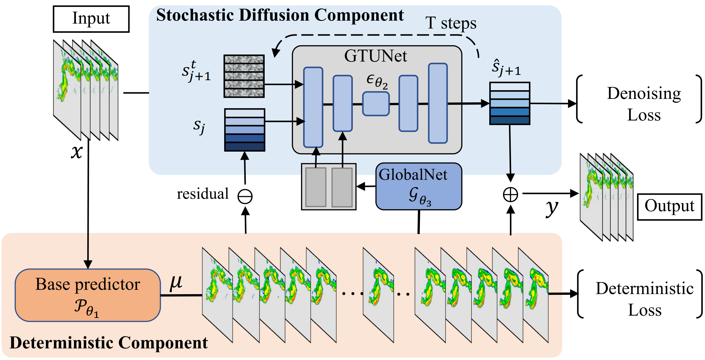
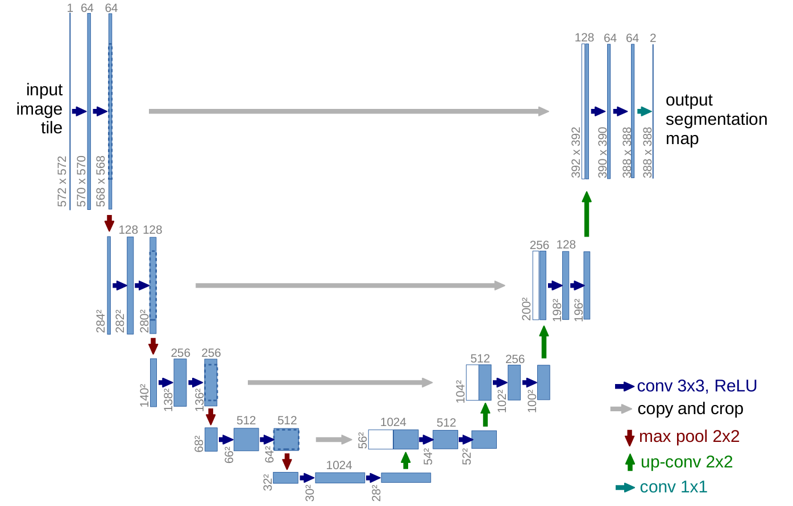
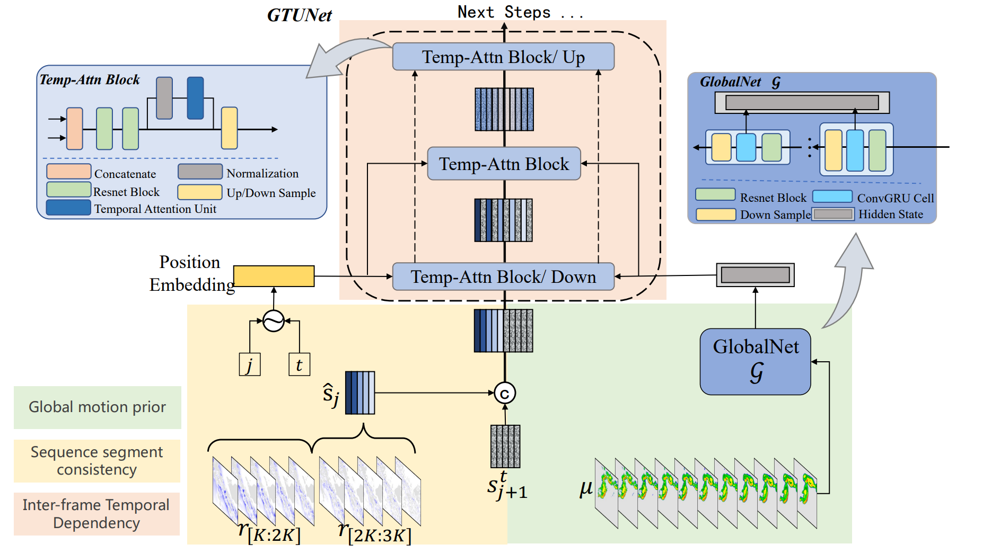
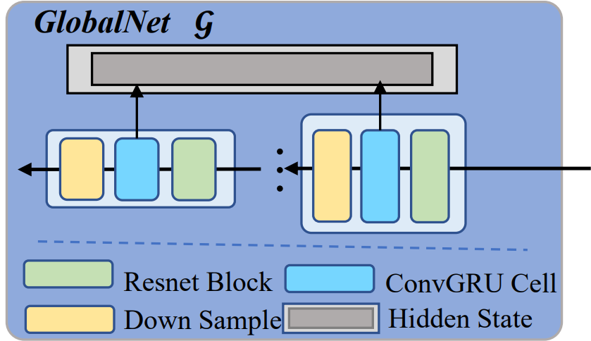
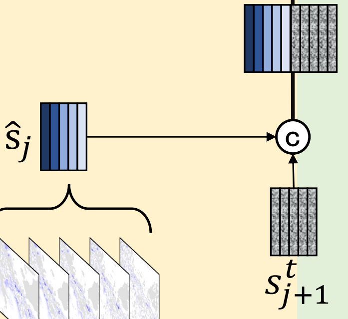
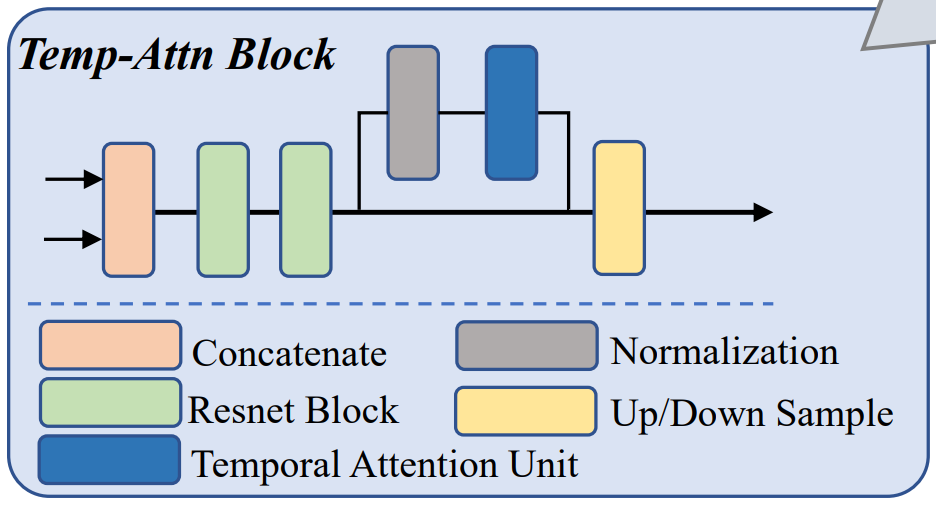

+++
date = '2026-02-24T20:32:24+08:00'
draft = true
title = '”残差扩散“拯救短临降水预测？DiffCast论文阅读'
ShowToc = false
math = true
categories = ["draft"]
tags = []
+++

在刚接触气象领域研究时，学长推荐我阅读《[DiffCast: A Unified Framework via Residual Diffusion for Precipitation Nowcasting](https://arxiv.org/abs/2312.06734)》这篇论文，说可以参考学习**扩散模型**如何应用在气象领域，解决短临降水问题。

学长自己的研究中，曾经将 **DiffCast** 作为Baseline之一（据他自己说，效果不够好hh）。我们现在手上的工作也是扩散模型相关，因此阅读这篇论文还是很有必要的。

## 相关知识铺垫

### 短临降水问题定义

我们来看看文章如何定义短临降水问题：

短临降水问题可以表述为一个时空预测问题（***Spatio-temporal prediction problem***），基于当前的观测数据，预测未来很短时间范围内（0~6h）的高时空分辨率降雨情况

- 输入：$L_{in}$ 帧初始雷达回波图像序列 $x=[x_i]^0_{i=-L_{in}} \in \mathbb{R}^{L_{in} \times H \times W \times C}$

- 输出：未来 $L_{out}$ 帧序列 $y=[y_i]^{L_{out}}_{i=1} \in \mathbb{R}^{L_{out} \times H \times W \times C}$

- 数学本质：建模条件概率分布 $p(y|x)$
  
  > 翻译一下，这个公式表示 ”**在已知 $x$ 的条件下，$y$ 发生的概率分布**“。
  > 
  > 我们预测的不是唯一的结果，而是要所有未来情况的发生概率。

短临降水问题不仅仅是“预测下一帧图像”，而是一个**需要同时解耦并建模“全局确定性运动”与“局部随机残差”的复杂时空演化问题**。

### 扩散模型

扩散模型（***DDPM***）主要包含两个过程：

1. 前向扩散（Forward Diffusion）
   
   给定一个清晰图像 $x_0$，在 $T$ 步内逐步加入高斯噪声，得到 $x_1,x_2,\dots,x_T$ 。到了 $x_T$ ，图像就变成了纯高斯噪声。

2. 逆向去噪（Reverse Denoising）
   
   我们希望训练一个神经网络，参数是 $\theta$ 。
   
   它的任务是：给定第 $t$ 步的噪声图 $x_t$ 和时间步 $t$ ，预测出第 $t-1$ 步稍微清晰一点的图 $x_{t-1}$

> 有时间会补充对扩散过程完整的数学定义，或者另起一个博客（）

那么具体的训练目标是什么呢？论文采用了简化的损失函数，让网络预测加入的**噪声 $\epsilon$** 。

可以这样理解扩散模型的工作流程：

> 我们故意在图里加入噪声，让神经网络学习去猜我们加入了多少噪声。
> 
> 猜得越准，说明神经网络越有能力把噪声去掉。
> 
> 这样，模型就可以从噪声中还原出我们想要的东西。

值得一提的是，DiffCast 并不是用扩散模型直接生成降水数据，而是预测 **”残差“**，这个思想在我们的研究中同样也有参考，后面会详细阐述。

## 论文方法

Diffcast 旨在将降水系统分解为**全局运动趋势**（***global motion trend***）和**局部随机残差**（***local stochastic residual***）（ $y$ 表示**未来降水**），

$$
y=\underbrace{\mu}_{\text{全局运动趋势}}+\underbrace{r}_{\text{局部随机残差}}
$$

并分别用**确定性组件**（***deterministic component***）与**随机扩散组件**（***stochastic diffusion component***）进行建模。

> - **确定性组件**（下方橙色）：
>   
>   输入历史帧 $x$，通过 Base predictor $\mathcal{P}_{\theta_1}$ 生成**全局运动趋势** $\mu$ 
>   
>   粗预报，捕捉云系整体移动但模糊
> 
> - **随机扩散组件**（上方蓝色）：
>   
>   计算残差 $r=y-\mu$ （真实值与趋势的偏差），通过 GTUNet（包含 GlobalNet 提取全局运动先验）对残差进行扩散建模，生成**局部随机细节** $\hat{s}$ 
> 
> - 输出：最终预测 $\hat{y}=\mu+\hat{s}$（趋势 + 残差修正）

文章提到，两个组件以端到端方式同步训练，自然地相互协作。

> 端到端（***End-to-End***），多个组件**同时、联合训练**，而不是**分阶段各自独立训练**。

### 确定性预测骨干

这是一个通用模块，确定性组件允许采用**任何确定性预测模型**作为基础预测器 $\mathcal{P}_{\theta_1}(\cdot)$ ，无需额外配置

我们把基础预测器的输出记为 $\mu=[\mu_i]^{L_{out}}_{i=1} \in \mathbb{R}^{L_{out}\times H \times W \times C}$ 

通过给定输入帧 $x$ ，利用任意像素级损失来建模学习 $p_{\theta_1}(\mu|x)$ ，比如 MSE：

$$
\mathcal{L}_\mathcal{P}=\mathbb{E}[\lVert \mu-y \rVert^2]
$$

或其他原生设计的损失函数，可以跟着预测模型本身调整。$\theta_1$ 表示该部分的参数。我们称这部分损失为确定性损失（***deterministic loss***）。

对然这种方式得到的预测 $\mu$ 存在模糊（***blurry***）和高值回波衰减（***high-value echoes fading away***）问题，但能够捕捉全局运动趋势，有助于后续解耦局部随机残差。$\mu$ 本身也会为扩散组件提供必要信息。

> 这里提到的**模糊**与**高值回波衰减**问题，是深度学习**确定性预测**的固有缺陷。
> 
> 1. 模糊——边缘变糊了
>    
>    历史帧的强对流中心边界锐利清晰，而预测出来的降水区域像被高斯模糊过。
>    
>    这是因为 MSE 存在 **“平均效应”**，模型会倾向于预测周围像素的平均值，这会导致位置偏移一点，而不至于惩罚太大。
>    
>    最终导致锐利的雨带边缘被“涂抹”成渐变，失去细节纹理。
> 
> 2. 高值回波衰减——暴雨变小雨
>    
>    真实观测到暴雨，而预测未来变为中雨甚至消失。
>    
>    实际上云团只是移动，强度并未快速衰减，但模型预测其消失。
>    
>    导致这种情况有多种原因：
>    
>    1. 数据不平衡：数据集暴雨占比少，模型没学会维持强对流
>    
>    2. MSE 的保守偏见：预测小雨虽然不准确，但模型受到惩罚的风险小，导致模型**低估极端值**
>    
>    3. 时间漂移累积：多步预测时，每一步的小衰减会累积，导致长时效预测强降水消失
> 
> 而这些缺陷正是**随机扩散组件**要修正的。

### 随机残差预测

关于局部随机性，我们计算真实值 $y$ 与 $\mu$ 的残差$r$ 来表征，也就是：

$$
r=y-\mu
$$

但未来降水的真实值 $y$ 未知，因此 $r$ 无法直接预测。

DiffCast 训练扩散模型来**预测残差的演化** 。由于 $r$ 表示从 $1$ 到 $L_{out}$ 的序列，我们以自回归方式对其演化进行建模，扩散模型需要建立分布：

$$
p_{\theta_2}(r_i \mid \hat{r}_{i-1})
$$

其中 $\hat{r}_{i-1}$ 表示第 $i-1$ 帧的预测残差，$\theta_2$ 为扩散模型参数。

> **自回归方式**（***autoregressive manner***）用前一刻的预测结果，作为下一刻预测的输入。
> 
> 这里表示我们预测第 $i$ 帧残差时，模型不仅会看历史观测，还会看预测的第 $i-1$ 帧残差。

假设我们使用 $T$ 步去噪扩散建模该分布。前面我们提到过扩散模型的反向去噪过程：

$$
p_\theta(y^{t-1} \mid y^t)=\mathcal{N}(y^{t-1};\mu_\theta(y^t,t),\sigma^2_tI)
$$

应用到残差预测的场景，有公式：

$$
p_{\theta_2}(r^{0:T}_i \mid \hat{r}_{i-1})=p(r^T)\prod_{t=1}^{T}p_{\theta_2}(r^{t-1}_i \mid r^t_i,\hat{r}_{i-1})
$$

其中 $r^T \sim \mathcal{N}(0,I)$ ，$t$ 为去噪步；$r^t_i$ 表示第 $i$ 帧残差的第 $t$ 个去噪状态。

---

这里容易混淆**时间帧** $i$ 与**去噪步** $t$ 

1. 时间帧：上述公式中 $r$ 的下标，描述的是降水的时间点，一帧对应一个时刻。
   
   范围是 $[-L_{in}, \dots, 0,1,2,\dots,L_{out}]$ ，其中 $[1,\dots,L_{out}]$ 是需要预测的未来时间帧。
   
   预测第 i 帧降水时，会参考 i-1 帧，也就是之前时间点的降水。

2. 去噪步：$r$ 的上标，描述的是扩散模型的**反向过程**中的**去噪状态**。
   
   范围是 $[1,2,\dots,T]$。反向过程学习去噪，去噪步从大到小，图像越来越清晰，最后生成目标图像。

---

反向去噪过程中，从公式上看，我们需要训练神经网络学习预测 $\mu_\theta$ 。经过数学推导，我们可以得到均值预测公式：

$$
\mu_\theta(y^t,t)=\frac{1}{\sqrt{\alpha_t}}(y^t-\frac{\beta_t}{\sqrt{1-\overline{\alpha}_t}} \epsilon_\theta(y^t,t)
$$

根据这个公式，我们可以把**优化目标**从均值预测转变为**噪声估计**。也就是说，去噪过程中，从状态 $r^t_i$ 恢复状态 $r^{t-1}_i$ 等价于**估计第 $t$ 步加入的噪声 $\epsilon$** 。

我们假设扩散过程中每一步的去噪函数为：$\epsilon_{\theta_2}(r^t_i,\hat{r}_{i-1},t)$ ，输入包括先前扩散状态 $r^t_i$ 和最近预测残差 $\hat{r}_{i-1}$ 为输入。

最后得到的目标函数为：

$$
\mathcal{L}_\epsilon=\mathbb{E}_{(r_{i},r_{i-1}) \sim r, t, \epsilon \sim \mathcal{N}(0,I)} \lVert \epsilon - \epsilon_{\theta_2}(r^t_i,\hat{r}_{i-1},t) \rVert^2
$$

其中第 $t$ 个去噪状态可以计算为：

$$
r^t_i=\sqrt{\overline{\alpha}_t}({\underbrace{y-\mathcal{P}_{\theta_1}(x))_i}_{\text{残差}}}+\sqrt{1-\overline{\alpha}_t}\epsilon
$$

我们称这个目标函数为**去噪损失**（***denoising loss***）

就像前面说的，作者用端到端方式训练框架，采用如下联合损失函数：

$$
\mathcal{L}=\alpha\sum_{r_i \in r}\mathcal{L}_\epsilon(r_i)+(1-\alpha)\mathcal{L}_\mathcal{P}
$$

其中 $\alpha \in [0,1]$ 为平衡两个损失的权重因子。 

训练完成后，我们可以通过先前残差 $\hat{r}_{i-1}$ ，从高斯噪声开始迭代去噪来预测 $r_i$，公式如下：

$$
y^{t-1}=\frac{1}{\sqrt{\alpha_t}}(y^t-\frac{\beta_t}{\sqrt{1-\overline{\alpha}_t}}\epsilon_\theta(y^t,t))+\sigma_t\epsilon
$$

重复此过程 $L_{out}$ 次，得到估计的残差序列 $\hat{r}=[\hat{r}_i]^{L_{out}}_{i=1}$ 。

> 注意，文章中设置 $\hat{r}_0=0$ 。这里可能会令人困惑，我们来解释一下。
> 
> 我们预测未来的残差，以未来第1帧为例，记为 $\hat{r}_1$ 。根据前文所说，我们希望模型建立分布：$p_{\theta_2}(r_i \mid \hat{r}_{i-1})$ ，即 $p_{\theta_2}(r_1 \mid \hat{r}_0)$ 。
> 
> 也就是说，我们预测第1帧时，依赖于第0帧的预测结果。但未来第0帧这种概念是不存在的，所以我们人为设置 $\hat{r}_0=0$ 。
> 
> 由此，未来第1帧的预测完全基于
> 
> 1. 历史观测 $x$ （通过 GlobalNet 编码，见后）
> 
> 2. 确定性趋势 $\mu_1$（来自 $\mathcal{P_{\theta_1}}$）
> 
> 3. 从纯噪声开始的扩散去噪过程

最后，我们得到最终预测结果

$$
\hat{y}=\hat{r}+\mu
$$

### 全局时序UNet (GTUNet)

在随机残差预测中，作者设计了一系列详细扩散组件，其中包括：**全局时序UNet**（***Global Temporal UNet***）。

> 这里简单讲讲 UNet，后面有机会单开一个博客。
> 
> **UNet** 是一种**编码器-解码器架构**的卷积神经网络，最初用于生物医学图像分割。其核心结构由**收缩路径**与**扩张路径**组成对称的 U 形拓扑。
> 
> 
> 
> 该架构的关键在于保留了高分辨率的细粒度特征，使得网络能够同时捕捉全局上下文与局部边界细节，在像素级预测任务中实现了高精度定位。
> 
> 值得一提的是，扩散模型领域的开创性工作（[Denoising Diffusion Probabilistic Models](https://arxiv.org/abs/2006.11239)）就采用了UNet作为**噪声估计网络的骨干架构**。

GTUNet 从多个尺度进行残差演化预测：**全局运动先验**（***global motion prior***）、**序列分段一致性**（***sequence segment consistency***）和帧间时序依赖性（***inter-frame temporal dependency***）

#### 全局运动先验

如图中绿色部分所示，作者设计了一个类 ConvRNN 的结构 **GlobalNet $\mathcal{G}_{\theta_3}$** ，从确定性基线预测 $\mu$ 中提取**全局运动趋势信息**，定义为 $h$ ：

$$
h=\mathcal{G}_{\theta_3}(\mu)=\mathcal{G}_{\theta_3}(\mathcal{P}_{\theta_1}(x))
$$

其中 $\theta_3$ 代表 GlobalNet 的参数。

> 这里解释一下什么是 **ConvRNN**：
> 
> ConvRNN（***Convolutional Recurrent Neural Network*，卷积循环神经网络**）是一种**将卷积神经网络（CNN）的空间表征能力与循环神经网络（RNN）的时序建模能力耦合的混合架构**，专门用于处理具有**时空连续性的高维序列数据**（如视频帧、气象雷达回波序列）。
> 
> 标准 RNN 处理图像序列时，通常将每帧展平为向量，导致空间拓扑信息丢失。ConvRNN **将状态转移矩阵替换为卷积核**，解决了这个问题。
> 
> 与全连接 RNN 不同的是，ConvRNN 继承了 CNN 的**空间平移等变性**（***Spatial Translation Equivariance***）：输入序列中的空间模式在帧间移动时，其对应的隐藏状态特征图也会相应平移，而不会被固定到特定位置的全连接权重“锁定”。这一点在气象预测中很重要，避免了模型预设对降水系统的空间先验。
> 
> ConvRNN通过在不同时间步与空间位置共享卷积核参数，参数量得到降低，参数效率提高；同时通过堆叠多层或膨胀卷积（**Dilated Convolution**），可以扩大时序感受野，捕捉长程运动轨迹。

GlobalNet 的具体结构如下所示：

它是一个具有多个时序模块的多层架构，每个时序模块由一个下采样算子、一个 ConvGRU 算子、一个 ResNet 算子组成。

---

我们来看看 GlobalNet 的细节

- **输入**：来自 Base Predictor 的预测结果。这是预测得到的**未来帧序列**，但存在模糊、细节丢失等问题。

- **目标**：GlobalNet 并不修改 $\mu$ 的结果，而是提取其中的**运动规律**，得到一个**高维隐藏状态 $h$** ，后续会提供给扩散模型。

数据输入 GlobalNet 后会经过多个时序模块（***Temporal Block***），每个 Block 中首先下采样，**空间分辨率逐层降低**，实现”在底层保留精细的空间细节，在高层捕捉大尺度的整体运动趋势“。

> 这里图上似乎容易让人误解，但根据实际训练流程，我们认为在一个时序模块中下采样（黄色）是**最先进行**的。

这里解释一下这些算子：

##### Down Sample（下采样）

这一步可以理解为是在**降低数据的分辨率**，或者更加直观，**把图像变小**。

每经过一个时序模块，进行一次下采样，降水图的尺寸缩小一次（例如 128×128 →  64×64 → 32×32）。

这样可以提取**不同尺度下的运动规律**，最后会组合成为最后的 $h$ 。

##### ConvGRU Cell（卷积门控循环单元）

- CNN只能独立分析每一张图片，无法捕捉多张图像之间的时序关系；

- GRU 是典型的 RNN，能够”记忆“序列数据的特点，但普通 GRU 通常处理一维序列，需要输入一个向量。

在这里，ConvGRU 可以结合上述两种模型的优点，它能够理解降水图像数据（卷积），学习降水系统是如何从过去移动到未来的（GRU）。

我们来看看 **GRU**（***Gated Recurrent Unit***）是如何工作的：

RNN，也就是循环神经网络，它可以说是为了处理序列数据 $\mathcal{X}=(x_1,x_2,\dots,x_T)$ 而生。标准 RNN 会通过一个递推公式计算**隐状态序列** $\mathcal{H}=(h_1,h_2,\dots,h_T)$ ：

$$
h_t=\phi({W_{xh}x_t+W_{hh}h_{t-1}+b}), \;\;\; t=1,\dots,T 
$$

前面我们所说的，需要”从确定性组件的预测数据中提取的“全局运动趋势，就是这里的**隐状态**（***Hidden State***）。

从递推公式上可以看到，某个时刻 $t$ 的隐状态 $h_t$ 依赖于当前数据 $x_t$ 以及前一个时刻的隐状态 $h_{t-1}$。可以这样理解，$h_t$ 编码了历史输入 $x_{1:t}$ 的历史表征。

> - 我们说 $h_t$ 包含了 $x_1,x_2,\dots,x_t$ 的信息，这一点可能有些不好理解。其实可以从递推公式中得到。我们简化递推函数并把 $h$ 都用递推函数写出来：
>   
>   $h_t=\mathcal{F}_\theta(h_{t-1},x_t)=\mathcal{F}_\theta({\mathcal{F}_\theta(h_{t-2},x_{t-1})},x_t)=\cdots$
>   
>   最后会发现，$h_t$ 仅依赖于 $x_{1:t}$ （当前与过去，与未来 $x_{t+1:T}$ 无关），而且不需要显式访问 $x_{1:t-1}$ ，因为 $h_{t-1}$ 中包含了这些信息。
>   
>   也就是说，$h_t$ 是 $x_{1:t}$ 的**有损压缩**。它忽略了对未来预测无关的细节，保留最关键的动力学特征，也就是我们需要的全局运动趋势。
> 
> - **”时刻 $t$ “** 应该理解为序列中数据的次序，而不是狭义的时间点。

与传统RNN相比，GRU引入了**门控机制**：重置门 $\mathbf{r}_t$ （如果历史数据已经过时，把它遗忘），更新门 $\mathbf{z}_t$（新的数据有哪些值得记录，记录下来）。可以理解为，GRU对历史数据进行**选择性记忆**，保留大尺度平流趋势的同时，也要及时遗忘已消散的局部对流。

> 这里对门控的详细数学定义不详细展开，未来有机会单开文章。

##### Resnet Block（残差块）

这部分是一个时序模块的最后一步。一方面，它的输出会汇入全局隐藏状态 $h$ ；另一方面，还会传入下一个时序模块，继续提取更粗尺度特征。

残差块对 ConvGRU 编码的内容进行**非线性变换与筛选**，提取当前尺度的运动特征，并通过**残差连接**保护已经编码的时序信息不被过度扭曲。

> 标准卷积网络会有**梯度消失**的问题。**残差连接**（***Residual Connection***）可以解决这个问题，它的输出可以记作：
> 
> $\mathbf{y}=\mathcal{F}(\mathbf{x})+\mathbf{x}$
> 
> 通过 $+\mathbf{x}$ 保证深层网络能够被有效训练，也避免已经编码的时序特征被过度平滑或扭曲。

---

将提取的隐状态 $h$（Hidden State）作为额外条件注入扩散模型，残差预测重新表示为：

$$
r=[p_{\theta_2}(r_i \mid \hat{r}_{i-1},h)]^{L_{out}}_{i=1}
$$

相应的，去噪函数变为：

$$
\epsilon_{\theta_2}(r^t_i,\hat{r}_{i-1},\mathcal{G}_{\theta_3}(\mathcal{P}_{\theta_1}),t)
$$

此时，前面提到的模型训练目标函数

$$
\mathcal{L}=\alpha\sum_{r_i \in r}\mathcal{L}_\epsilon(r_i)+(1-\alpha)\mathcal{L}_\mathcal{P}
$$

由 $(\theta_1,\theta_2,\theta_3)$ 共同参数化。

#### 序列分段一致性

为了更好地保持残差演化的序列一致性，作者建议将残差序列 $r$ 划分为多个段 $s$ 进行预测。

> 有研究（[MIMO Is All You Need : A Strong Multi-In-Multi-Out Baseline for Video Prediction](https://arxiv.org/abs/2212.04655)）表明，在循环时空预测中，多输入多输出（MIMO）优于单输入单输出(SISO)。

具体示意图见前图黄色部分。我们构建分段并将第 $j$ 段（从0开始）记为：

$$
s_{j-1}=r_{[(j-1)K:jK]}
$$

其中 $K$ 表示每段的长度，$j=0,1,\dots,[L_{out}/K]$ 。

由此，得到 $s_j \in \mathbb{R}^{K \times H \times W \times C}$ ，扩散模型转变为对**段级**时序分布建模：

$$
s=[p_{\theta_2}(s_j \mid \hat{s}_{j-1},h)]^{\frac{L_{out}}{K}}_{j=1}
$$

这里的划分是人为进行的，那么预测后我们也需要人为地**拼接**起来。我们通过在 $t$ 步去噪状态 $s^t_j$ 与前一段 $s_{j-1}$ 之间进行**通道拼接**（***channel concatenation***）来融入段条件。

---

这里详细讲讲什么是**通道拼接**：

给定两个张量 $\mathbf{A},\mathbf{B} \in \mathbb{R}^{K \times H \times W \times C}$ （分别对应上面说的 $s_{j-1}$ 和 $s^t_j$ ），通道拼接也就是沿着最后一个维度连接：

$$
\text{Concat}(\mathbf{A},\mathbf{B}) \in \mathbb{R}^{K \times H \times W \times 2C}
$$

可以这样理解，我们把两张特征图拼成更厚的“千层饼”，网络可以同时看到“**上一段预测了什么**”和“**当前段带噪状态是什么**”。通过显式拼接条件，强制模型维护段与段之间的时序连贯性。

也就是示意图中这部分（段序号的标注有区别，但无大碍）：

---

此外，随着预测提前期的增加，由于不确定性增加，残差也会不可避免地变大。因此，我们需要**显式指示段的位置**。在设计模型时，除了对去噪步数添加**位置嵌入**外，还对**段索引** $j$ 添加了额外的位置嵌入。

至此，残差演化扩散模型的目标函数变为：

$$
\mathcal{L}_\epsilon=\mathbb{E} \lVert \epsilon - \epsilon_{\theta_2}(s^t_j,\hat{s}_{j-1}, \mathcal{G}_{\theta_3}(\mathcal{P}_{\theta_1}(x)),t,j) \rVert^2
$$

> 值得一提的，和前面提到的 $\hat{r}_0=0$ 类似，在预测第一段残差 $s_1$ 时，使用 $s_0=0$

#### 帧间时序依赖性

为了更好地建模**段内**的帧间依赖性，DiffCast 的GTUNet包含了**时序注意力块**（***Temp-Attn Block***）。实际上，它是 DDPM 中 UNet 的一种时序演化变体。

时序注意力块由拼接算子、ResNet算子、归一化算子和时序注意力算子构成。

随后，时序注意力块连接上采样/下采样算子（示意图浅橙色部分），使得段内的预测残差具有时序依赖性。

---

来看看时序注意力块的详细部分：（待补充）

- Concatenate

- Resnet Block

- Normalization

- Temporal Attention Unit

- Up/Down Sample

---